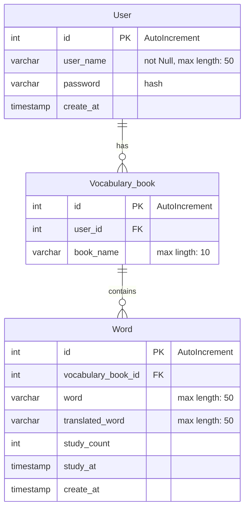

# backend

## 目的

- バックエンドのコードをまとめる。
- Go使うので、クリーンアーキテクチャを目指す
  - ただ、アプリ自体が単純な構成なので、いい感じに省略する。


## 構成

### コアドメイン

- 単語帳の復習

### サブドメイン

- 復習タイミングのスケジューリング
  - 復習間隔の算出
  - お知らせ

- オリジナルの単語帳の作成
  - 単語の翻訳

### 外部システム

- DeepL
  - 単語作成時に翻訳
- LINE notify
  - 復習周期により、通知

### ディレクトリ構成

| directory            | role                                      | this time          |
| ---                  | ---                                       | ---                |
| domain               | エンティティ・モデル                        | model.go, 共通機能  |
| usecase              | ビジネスロジック                            | 復習時期の計算, 認証 |
| Interface/Controller | リクエストを受け取る。ユースケースを呼び出す。 | frontとのやり取り(入力) |
| Interface/presenter  | レスポンスのフォーマット                     | frontとのやり取り(出力) |
| Interface/gateway    | 外部apiとの接続                             | DB, LINE, DeepL       |
| Infra                | ライブラリの依存関係                         | DBマイグレーション  |

＊本来のクリーンアーキテクチャでは、interface/gatewayではデータの取得しかやらないと思うが、今回はむしろコードが煩雑になるため、データの整形までやる。

```
backend
|
├── main.go
|
├── src
|    ├── domain
|    |    └── model
|    ├── usecase
|    ├── Interface
|    |    ├── controller
|    |    ├── presenter
|    |    └── gateway
|    └── Infra
|
├── db
|    └── migrations/schema.sql
```

## DB



### 接続方法

- ディレクトリ移動: cd src/infra/db/
- dockerのビルド: docker compose up
- docker内に入る: docker exec -it db bash
  - mysql内に入る : mysql -u root -p
    - password                     : root
    - DBの確認                      : show databases;
    - my-vocabulary-book へアクセス : use my-vocabulary-book;
      - tableの確認                 : show tables;
  - mysql外に出る : exit

- dockerに入ると同時にmysqlへ : docker exec -it db mysql -uroot -proot
