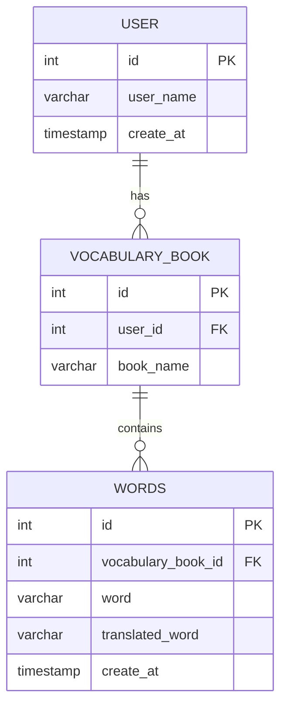

# backend

## 目的

- バックエンドのコードをまとめる。


## 構成
```
backend
├── src
|    ├── main.go
|
|
├── db
|    └── my.cnf
```

## DB


```mermaid
erDiagram
    USER {
        int id PK
        varchar user_name
        timestamp create_at
    }

    VOCABULARY_BOOK {
        int id PK
        int user_id FK
        varchar book_name
    }

    WORDS {
        int id PK
        int vocabulary_book_id FK
        varchar word
        varchar translated_word
        timestamp create_at
    }

    USER ||--o{ VOCABULARY_BOOK : "has"
    VOCABULARY_BOOK ||--o{ WORDS : "contains"
```
