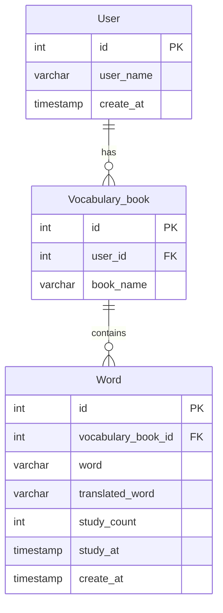

# backend

## 目的

- バックエンドのコードをまとめる。


## 構成

```
backend
|
├── main.go
|
├── src
|    ├── service
|    ├── repositories
|    └── controllers
|
├── db
|    └── migrations/schema.sql
```

## DB



### 接続方法

- dockerのビルド: docker compose up
- docker内に入る: docker exec -it db bash
  - mysql内に入る : mysql -u root -p
    - password                     : root
    - DBの確認                      : show databases;
    - my-vocabulary-book へアクセス : use my-vocabulary-book;
      - tableの確認                 : show tables;
  - mysql外に出る : exit

- dockerに入ると同時にmysqlへ : docker exec -it db mysql -uroot -proot
